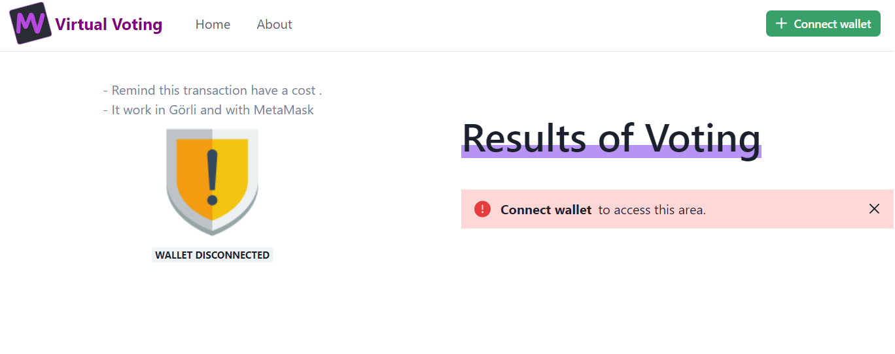
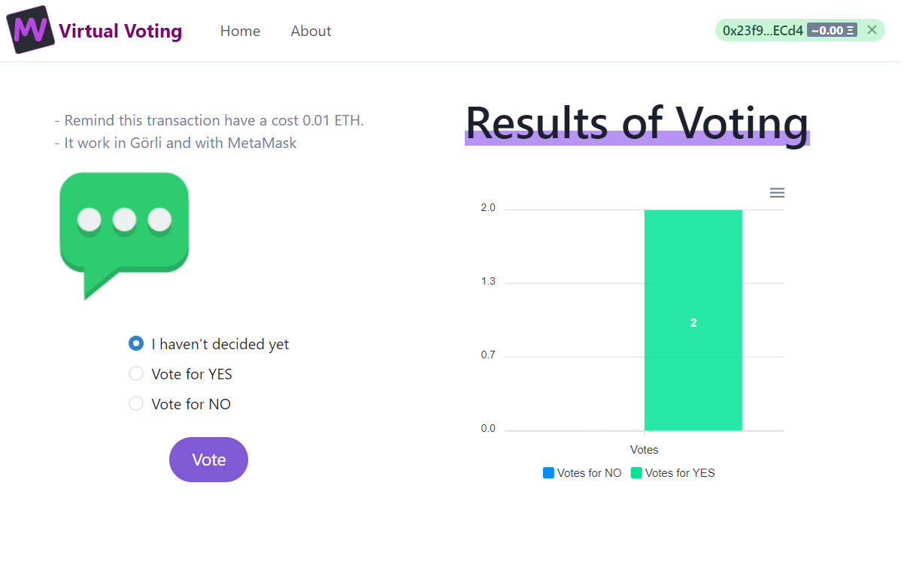
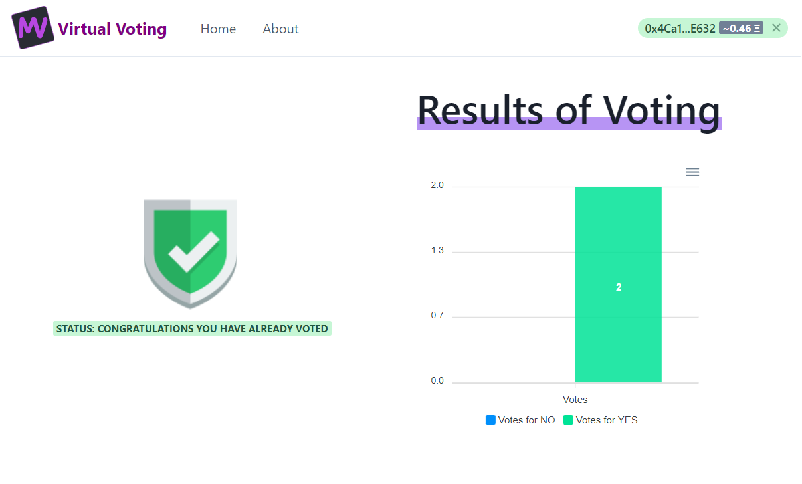
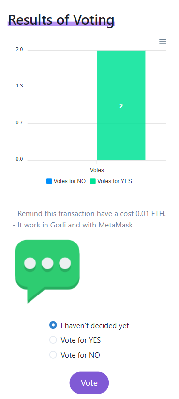
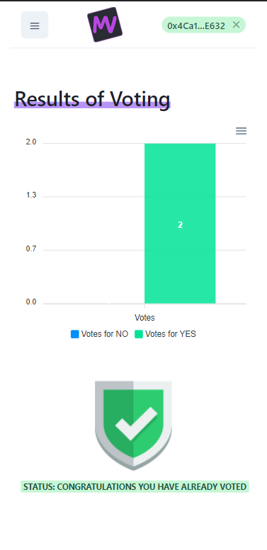

# Template for Web3 apps

Platform that will serve as a virtual voting assistant
For this challenge of Ethereum Developer Program [Link challenge](https://github.com/protofire/platzi-web3-libs).

This project looks like:
Web version:

Mobile version:

## Available Scripts

### `yarn start`

### `yarn test`

### `yarn build`

### `yarn eject`

### `yarn build`

By wolfcito
